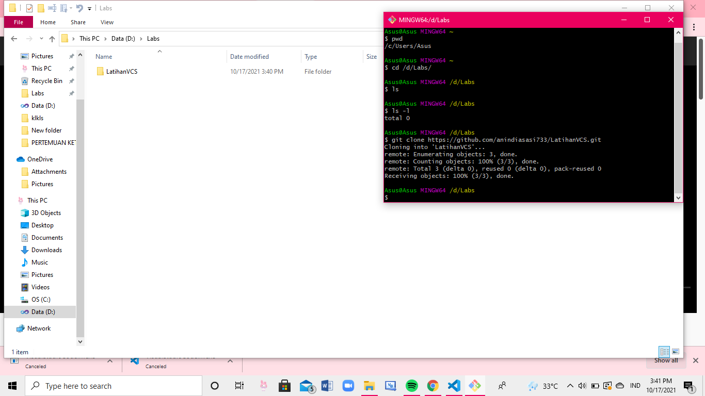

# LatihanVCS
## Tutorial menggunakan git 

### paragraf pertama

membuat akun terlebih dahulu 
 

### lalu buat folder 

### buka apk Git dan masukin code 
code pwd, cd /d/nama file anda/ 

ls, ls -l, git clone(code git anda), cd (nama filenya) 

git add (nama file anda), git status, git push -u origin main 

