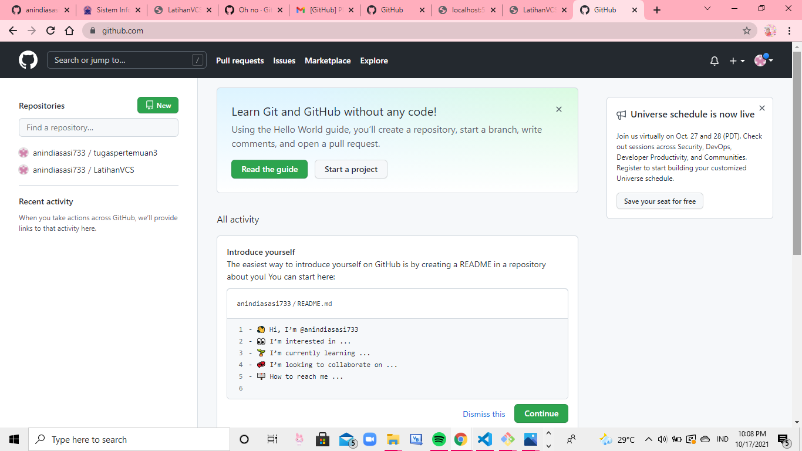

# LatihanVCS
## Tutorial menggunakan git 

###

### pertama
membuat akun terlebih dahulu 

lalu buat folder 

### kedua
buka apk Git dan masukin code 

code : pwd, cd /d/nama file anda/ 

ls, ls -l, git clone(code git anda), cd (nama filenya) 

git add (nama file anda), git status, git push -u origin main 

### ketiga
ketik email dan nama anda 

lalu akan ada tampilan seperti ini 

masuk dengan browser, lalu ketik password akun git anda 
 

### keempat
kalau sudah, anda bisa melakukan pekerjaan apa saja di git 

